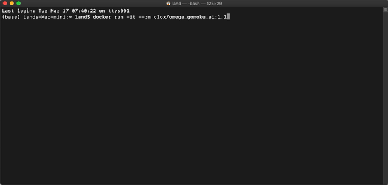
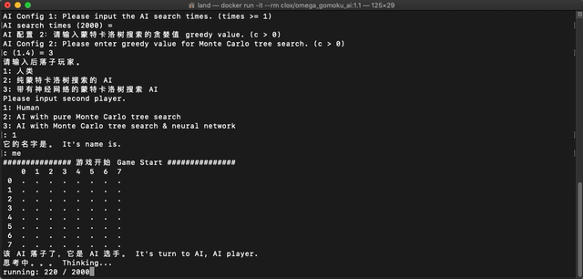
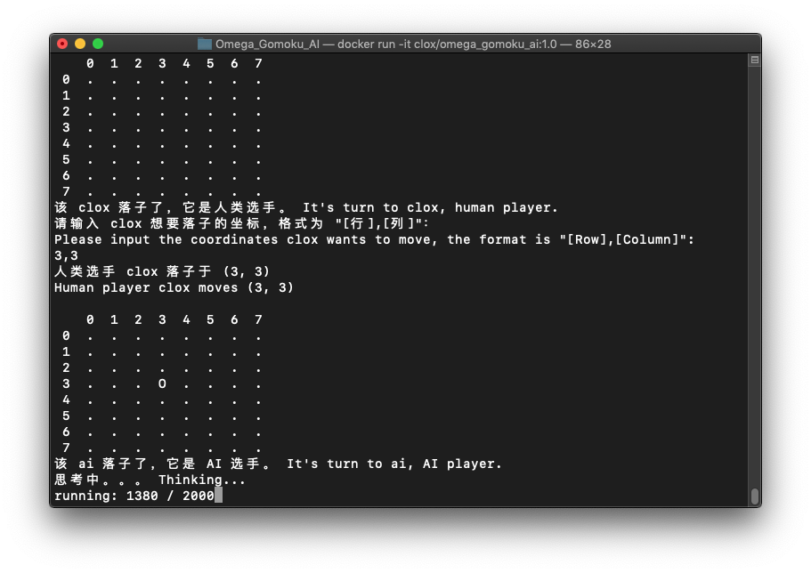
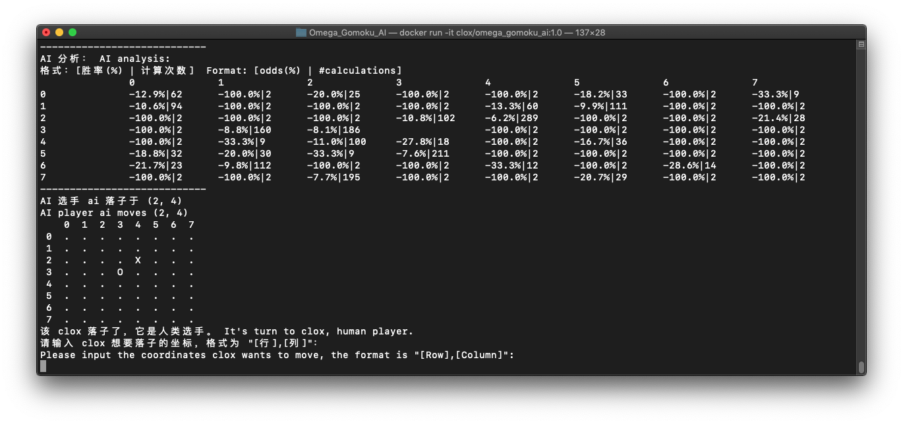
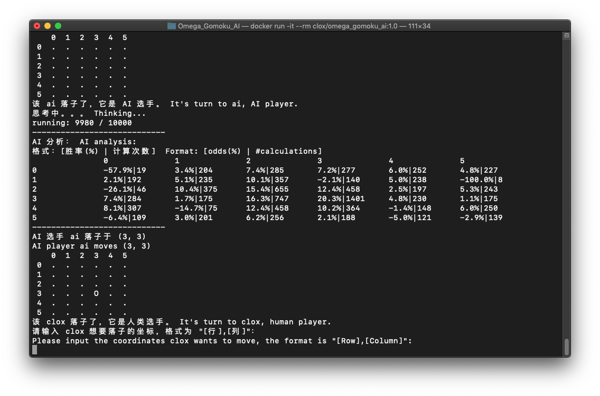
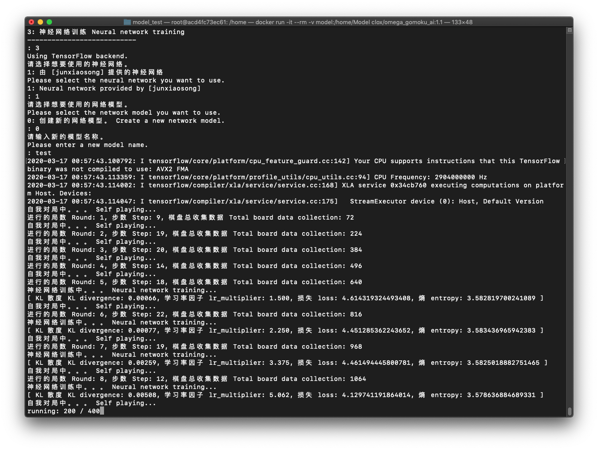

[](https://starkidstory.com)


# Omega_Gomoku_AI

**Omega_Gomoku_AI** is a Gomoku game AI based on Monte Carlo Tree Search. It's written in Python. The neural network part uses the Keras framework.

<p align="center">
<a href="https://starkidstory.com"></a>

<br/>
<a href="https://github.com/CLOXnu/Omega_Gomoku_AI/blob/master/README.zh-cn.md"></a>
</p>

**Omega_Gomoku_AI** is not only used for Gomoku game, but you can also customize the size of the board and an n-in-a-row game. Tic-tac-toe, for example, is a 3-in-a-row game, and played on a board of size 3.

This repo provides a ~~visual game interface~~, easy-to-use training process, and easy-to-understand code. 

Enjoy yourself ~~~

## ⬆️ Updates

1.1 is available, training.py etc. were added.

## 📖 References & thanks

About the algorithm, **Omega_Gomoku_AI** refers to this article: [Monte Carlo Tree Search – beginners guide](https://int8.io/monte-carlo-tree-search-beginners-guide/), written by [int8](https://github.com/int8).

**Omega_Gomoku_AI** Inspired by [AlphaZero_Gomoku](https://github.com/junxiaosong/AlphaZero_Gomoku) and [tictactoe_mcts](https://github.com/zhuliquan/tictactoe_mcts).


## 🏠 Code structure

- [start.py](start.py) - Start the game, human vs AI, or human vs human, or AI vs AI.
- [train.py](train.py) - The training script, which can be used to train with different networks and saved models.
- [configure.py](configure.py) - Configure the game, including board size, n-in-a-row, and Monte Carlo Tree search times.
- [game.conf](game.conf) - Configuration file.
- [Function.py](Function.py) - Some functions.
- [console_select.py](console_select.py) - Some console input functions.
- [Game/](Game/)
  - [Game.py](Game/Game.py) - An abstract class named Game, implemented by Console board and Visual board.
  - [ConsoleBoard.py](Game/ConsoleBoard.py) - implements class Game.
- [Player/](Player/)
  - [Player.py](Player/Player.py) - An abstract class named Player, implemented by Human and AIs.
  - [Human.py](Player/Human.py) - Human player, implements class Game.
  - [AI_MCTS.py](Player/AI_MCTS.py) - AI player with pure MCTS, implements class Player and MonteCarloTreeSearch.
  - [AI_MCTS_Net.py](Player/AI_MCTS_Net.py) - AI player with MCTS and neural network, implements class Player and MonteCarloTreeSearch.
- [AI/](AI/) - AIs.
  - [MonteCarloTreeSearch.py](AI/MonteCarloTreeSearch.py) - An abstract class MonteCarloTreeSearch, implements by all AIs using MCTS.
  - [MonteCarloTreeNode.py](AI/MonteCarloTreeNode.py) - Base class for nodes in Monte Carlo Tree.
  - [Network/](AI/Network/) - Networks.
    - [Network.py](AI/Network/Network.py) - An abstract class Network, implements by Networks.
    - [PolicyValueNet_from_junxiaosong.py](AI/Network/PolicyValueNet_from_junxiaosong.py) - A policy-value network, composed by [@junxiaosong](https://github.com/junxiaosong/AlphaZero_Gomoku).
    - ~~PolicyValueNet_AlphaZero.py - A policy-value network from AlphaZero paper.~~
- [Model/](Model/) - Models. Training data will be saved here.
    
    
    
## Usage

You can try **Omega_Gomoku_AI** yourself, and there are two ways to try it.

### via Docker

If you have installed Docker, run the following command:

```shell
$ docker pull clox/omega_gomoku_ai:1.1
```

Then, just run this:

```shell
$ docker run -it clox/omega_gomoku_ai:1.1
```

Add `--rm` after `-it` can automatically remove the container when it exits.

That's all, the above is the simplest usage, It's a really simple way!

It is worth noting that if you want to save the training data on your own machine, you need to add `-v` to mount directory.

```shell
$ docker run -it -v [Path]:/home/Model clox/omega_gomoku_ai:1.1
```

`[Path]` here should fill in the local model path you want to save or load. Remember, cannot use relative directory here.

That's all, It's a really simple way!

> *PS:*

> - [Homepage (clox/omega_gomoku_ai)](https://hub.docker.com/r/clox/omega_gomoku_ai) of this docker image.
> - The compressed size of the Docker image is about **493 MB**.
> - The Docker image is based on [tensorflow/tensorflow:2.0.0-py3](https://hub.docker.com/layers/tensorflow/tensorflow/2.0.0-py3/images/sha256-0b236338fac6c3361cf3ae1448f8c053994e260c1edc4fa63ed80adb3045abb2?context=explore).
> - [Docker accelerator](http://mirrors.ustc.edu.cn/help/dockerhub.html?highlight=docker) in China.

#### Example of running the simplest version with Docker

Configuring...



Running...




### via PC/Mac/Linux

Make sure you have a Keras backend (Tensorflow) environment installed on your computer, and after cloning this repo, then run the following command:

```shell
$ pip install -r requirement.txt
```

If necessary, the command 'pip' should be changed to 'pip3'.

In Mac/Linux, just run this:

```shell
$ bash game.sh
```

is enough. Or, you can also run:

```shell
$ python configure.py
```

to configure the game, and run:

```shell
$ python start.py
```

to start the game.

```shell
$ python train.py
```

to train a model.

Either installation way is fairly simple.


## Enjoy...

By default, this is a 5-in-a-row game played on an 8 * 8 size of board, and AI with pure MCTS searches 2,000 times each turn.





Sometimes, AI with pure MCTS may do weird action, because 2,000 times searching is not enough in a 5-in-a-row game in fact. So you can adjust the board size to 3 * 3 or 6 * 6, set to a 3-in-a-row or 4-in-a-row game, like tac-tic-toe.

Sure, It's a good idea to adjust 2,000 times to more, but it will take more time to think.

Now, we open the choice of greedy value, you can adjust the exploration degree of Monte Carlo tree search by yourself.



For example, I adjusted the number of Monte Carlo tree searches to 10,000 and played a 4-in-a-row game on a 6 * 6 board. It can be seen in the AI analysis that the Monte Carlo tree has traversed almost all of the board.

Will, AI with MCTS + neural network can solve this problem.

Training is available now.




## License

**Omega_Gomoku_AI** is licensed under MIT license. See [LICENSE](LICENSE) for details.

## To be continued...


