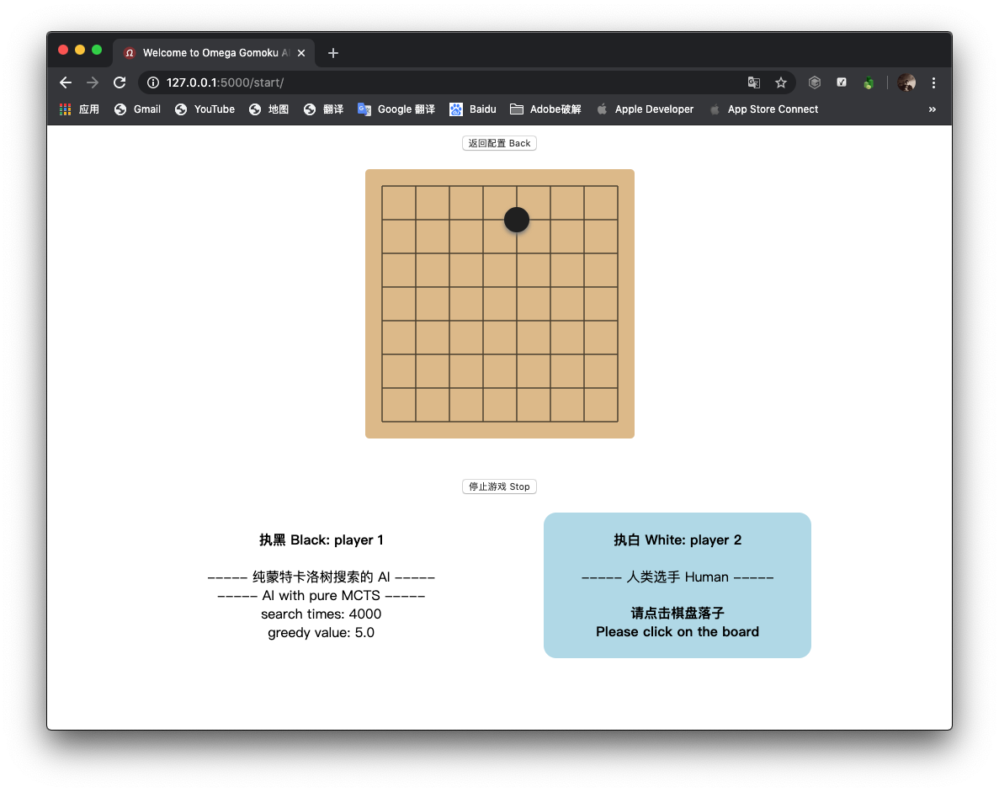

[](https://starkidstory.com)

[](https://starkidstory.com/index.php/category/omega/)

# Omega_Gomoku_AI

**Omega_Gomoku_AI** is a Gomoku game AI based on Monte Carlo Tree Search. It's written in Python. The neural network part uses the Keras framework.

<p align="center">
<a href="https://starkidstory.com"></a>
<a href="https://starkidstory.com/index.php/category/omega/"></a>
<br/>
<a href="https://github.com/CLOXnu/Omega_Gomoku_AI/blob/master/README.zh-cn.md"></a>
<a href="https://travis-ci.org/CLOXnu/Omega_Gomoku_AI"></a>
</p>

**Omega_Gomoku_AI** is not only used for Gomoku game, but you can also customize the size of the board and an n-in-a-row game. Tic-tac-toe, for example, is a 3-in-a-row game, and played on a board of size 3.

This repo provides a visual game interface, easy-to-use training process, and easy-to-understand code. 

Enjoy yourself ~~~

## 💥 Available now 💥



Run visual game using **web server** is available now!

1.3 is available, visual game etc. were added.

## 👣 Next step

✅ Monte Carlo tree -> ✅ Train models -> ✅ Visual game interface -> Custom battle.

## 📖 References & thanks

About the algorithm, **Omega_Gomoku_AI** refers to this article: [Monte Carlo Tree Search – beginners guide](https://int8.io/monte-carlo-tree-search-beginners-guide/), written by [int8](https://github.com/int8).

**Omega_Gomoku_AI** Inspired by [AlphaZero_Gomoku](https://github.com/junxiaosong/AlphaZero_Gomoku) and [tictactoe_mcts](https://github.com/zhuliquan/tictactoe_mcts).


## 🏠 Code structure

- [start.py](Omega_Gomoku_AI/start.py) - Start the game, human vs AI, or human vs human, or AI vs AI.
- [start_from_web.py](Omega_Gomoku_AI/start_from_web.py) - Start the visual game, and the web server.
- [train.py](Omega_Gomoku_AI/train.py) - The training script, which can be used to train with different networks and saved models.
- [configure.py](Omega_Gomoku_AI/configure.py) - Configure the game, including board size, n-in-a-row, and Monte Carlo Tree search times.
- [game.conf](Omega_Gomoku_AI/game.conf) - Configuration file.
- [Function.py](Omega_Gomoku_AI/Function.py) - Some functions.
- [console_select.py](Omega_Gomoku_AI/console_select.py) - Some console input functions.
- [Game/](Omega_Gomoku_AI/Game/)
  - [Game.py](Omega_Gomoku_AI/Game/Game.py) - A script to start the game.
  - [Board.py](Omega_Gomoku_AI/Game/Board.py) - Game board, including board rendering, execution and result determination.
  - [BoardRenderer.py](Omega_Gomoku_AI/Game/BoardRenderer.py) - An abstract class named BoardRenderer, implemented by ConsoleRenderer and VisualRenderer.
  - [ConsoleRenderer.py](Omega_Gomoku_AI/Game/ConsoleRenderer.py) - implements class BoardRenderer.
  - ~~VisualRenderer.py - implements class BoardRenderer.~~
- [Player/](Omega_Gomoku_AI/Player/)
  - [Player.py](Omega_Gomoku_AI/Player/Player.py) - An abstract class named Player, implemented by Human and AIs.
  - [Human.py](Omega_Gomoku_AI/Player/Human.py) - Human player, implements class Game.
  - [AI_MCTS.py](Omega_Gomoku_AI/Player/AI_MCTS.py) - AI player with pure MCTS, implements class Player and MonteCarloTreeSearch.
  - [AI_MCTS_Net.py](Omega_Gomoku_AI/Player/AI_MCTS_Net.py) - AI player with MCTS and neural network, implements class Player and MonteCarloTreeSearch.
- [AI/](Omega_Gomoku_AI/AI/) - AIs.
  - [MonteCarloTreeSearch.py](Omega_Gomoku_AI/AI/MonteCarloTreeSearch.py) - An abstract class named MonteCarloTreeSearch, implements by all AIs using MCTS.
  - [MonteCarloTreeNode.py](Omega_Gomoku_AI/AI/MonteCarloTreeNode.py) - Base class for nodes in Monte Carlo Tree.
  - [Network/](Omega_Gomoku_AI/AI/Network/) - Networks.
    - [Network.py](Omega_Gomoku_AI/AI/Network/Network.py) - An abstract class Network, implements by Networks.
    - [PolicyValueNet_from_junxiaosong.py](Omega_Gomoku_AI/AI/Network/PolicyValueNet_from_junxiaosong.py) - A policy-value network, composed by [@junxiaosong](https://github.com/junxiaosong/AlphaZero_Gomoku).
    - ~~PolicyValueNet_AlphaZero.py - A policy-value network from AlphaZero paper.~~
- [Train/](Omega_Gomoku_AI/Train/)
  - [train_with_net_junxiaosong.py](Train/train_with_net_junxiaosong.py) - Training script, called by 'train.py'.
- [Web/](Omega_Gomoku_AI/Web/)
  - [web_configure.py](Omega_Gomoku_AI/Web/web_configure.py) - The '/configure' flask pages.
  - [web_game_thread.py](Omega_Gomoku_AI/Web/web_game_thread.py) - The game script, using multithreading.
  - [web_select.py](Omega_Gomoku_AI/Web/web_select.py) - A class named web_select, used for web configure.
  - [web_start.py](Omega_Gomoku_AI/Web/web_start.py) - The '/start' flask pages, and websocket communication code.
  - [static/](Omega_Gomoku_AI/Web/static/)
    - [css/](Omega_Gomoku_AI/Web/static/css/) - css.
    - [js/](Omega_Gomoku_AI/Web/static/js/) - js.
  - [templates/](Omega_Gomoku_AI/Web/templates/) - htmls.
- [Model/](Omega_Gomoku_AI/Model/) - Models. Training data will be saved here.
    
    
    
## Usage

You can try **Omega_Gomoku_AI** yourself, and there are two ways to try it.

### via Docker

If you have installed Docker, run the following command:

```shell
$ docker pull clox/omega_gomoku_ai:latest
```

Then, just run this:

```shell
$ docker run -it clox/omega_gomoku_ai:latest
```

Add `--rm` after `-it` can automatically remove the container when it exits.

That's all, the above is the simplest usage, It's a really simple way!

If you want to render the visual game using web server in Docker, remember to enable port mapping:

```shell
$ docker run -it -p 5000:5000 clox/omega_gomoku_ai:latest
```

In addition to mapping to port 5000, you can also change '5000' before the colon to other values.

It is worth noting that if you want to save the training data on your own machine, you need to add `-v` to mount directory.

```shell
$ docker run -it -v [Path]:/home/Model clox/omega_gomoku_ai:latest
```

`[Path]` here should fill in the local model path you want to save or load. Remember, cannot use relative directory here.

That's all, It's a really simple way!

> *PS:*

> - [Homepage (clox/omega_gomoku_ai)](https://hub.docker.com/r/clox/omega_gomoku_ai) of this docker image.
> - The compressed size of the Docker image is about **456 MB**.
> - The Docker image is based on [tensorflow/tensorflow:2.0.0-py3](https://hub.docker.com/layers/tensorflow/tensorflow/2.0.0-py3/images/sha256-0b236338fac6c3361cf3ae1448f8c053994e260c1edc4fa63ed80adb3045abb2?context=explore).
> - If you use Docker, you do not need to clone this repo to your local machine.
> - [Docker Hub image cache](http://mirrors.ustc.edu.cn/help/dockerhub.html) in China.

#### Example of running the simplest version with Docker

Configuring...


Running...


### via PC/Mac/Linux

Make sure you have a Keras backend (Tensorflow) environment installed on your computer, and after cloning this repo, then run the following command:

```shell
$ pip install -r requirements.txt
```

If necessary, the command 'pip' should be changed to 'pip3'.

In Mac/Linux, just run this:

```shell
$ bash game.sh
```

is enough. Or, you can also run:

```shell
$ python configure.py
```

to configure the game, and run:

```shell
$ python start.py
```

to start the game.

```shell
$ python train.py
```

to train a model.

```shell
$ python start_from_web.py
```

to start the visual game using web server.

Either installation way is fairly simple.

#### About the parameters of 'train.py'

If you want to train on some cloud platforms, etc. that need to be quick and convenient and do not allow user input, you may need to run train.py with parameters:

```shell
$ python train.py 1 my_model 1000
```

The first parameter '1' means use the '1st' neural network, it must be the serial number of the neural network.

The second parameter 'my_model' means training the model named 'my_model'. If there is, it will automatically train the 'latest.h5' record. If there is no, it will automatically create it.

The third parameter '1000' indicates that the number of self-play is '1000'. If it is less than or equal to 0, it is infinite. It must be an integer.


## Enjoy...

By default, this is a 5-in-a-row game played on an 8 * 8 size of board, and AI with pure MCTS searches 2,000 times each turn.


Sometimes, AI with pure MCTS may do weird action, because 2,000 times searching is not enough in a 5-in-a-row game in fact. So you can adjust the board size to 3 * 3 or 6 * 6, set to a 3-in-a-row or 4-in-a-row game, like tac-tic-toe.

Sure, It's a good idea to adjust 2,000 times to more, but it will take more time to think.

Now, we open the choice of greedy value, you can adjust the exploration degree of Monte Carlo tree search by yourself.


For example, I adjusted the number of Monte Carlo tree searches to 10,000 and played a 4-in-a-row game on a 6 * 6 board. It can be seen in the AI analysis that the Monte Carlo tree has traversed almost all of the board.

Will, AI with MCTS + neural network can solve this problem.

Training is available now.


## License

**Omega_Gomoku_AI** is licensed under MIT license. See [LICENSE](LICENSE) for details.

## To be continued...


